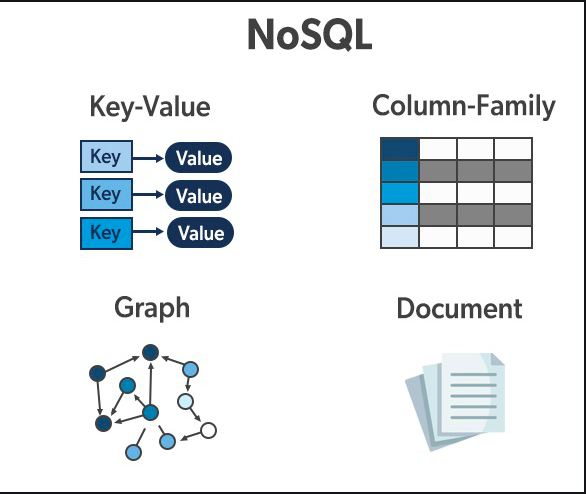

### Topic: Concurrency Control

### Learning outcomes

1. Understand the importance of locks in concurrency control.
2. Implement locks in database transactions.
3. Analyse various concurrency control schemes.

### Locks 
Locks are mechanisms used to control concurrent access to data. They ensure data integrity and consistency by preventing conflicts during concurrent transactions.

### Why lock resources
- Data Integrity: To ensure that transactions are executed in a way that maintains data consistency.
- Concurrency Control: To allow multiple transactions to access the database simultaneously without conflicts.
- Isolation: To maintain transaction isolation levels as required by ACID properties.

### Shared and Exclusive Locks

- Shared Lock (S-lock): Multiple transactions can read the data but cannot modify it.
- Exclusive Lock (X-lock): Only one transaction can read and modify the data. No other transaction can read or write the data until the exclusive lock is released.

Compatibility matrix

Every transaction must request a lock from the concurrency-control manager for its operations. It can proceed only after the lock is granted, allowing multiple readers but only one writer at a time and Locks are granted when no other transaction holds a conflicting lock and there are no earlier pending requests, preventing starvation.

### Two-Phase locking 
Two-Phase Locking (2PL) is a concurrency control method used in DBMS to ensure serializability, which is the highest level of isolation in transaction processing.

Phases of Two-Phase Locking

1. Growing Phase:

Lock Acquisition: A transaction can acquire locks (shared or exclusive) on data items it needs.
No Lock Release: During this phase, the transaction is not allowed to release any lock.
Operation: This phase continues until the transaction acquires all the locks it needs.

2. Shrinking Phase:

Lock Release: The transaction can release locks.
No Lock Acquisition: During this phase, the transaction cannot acquire any new locks.
Operation: This phase begins once the transaction starts releasing any of its locks.

### Deadlock
A deadlock occurs when transactions form a cycle, each waiting for locks to be released by the other. Deadlocks are managed through two primary methods: detection and prevention.

### Deadlock Detection
1. Waits-for Graph:

- Nodes: Transactions.
- Edges: An edge from Ti to Tj if Ti is waiting for Tj to release a lock.
- Cycle Check: The system periodically checks for cycles to detect deadlocks.

2. Handling Detected Deadlocks:

- Victim Selection: Rollback a transaction to break the cycle, considering factors like age, progress, and number of locks.

- Rollback Length:
  - Complete Rollback: Abort the entire transaction.
  - Partial Rollback: Use savepoints to rollback only part of the transaction.
  
  
### Deadlock Prevention
1. Priority-Based Prevention:

- Assign priorities based on timestamps:
  - Wait-Die: Older transactions wait for younger ones,     otherwise abort.
  - Wound-Wait: Younger transactions wait for older ones, otherwise older transactions abort.

2. Guaranteeing No Deadlocks:

- Only one type of wait direction is allowed.
- Restarting transactions retain their original timestamp to prevent starvation.

Deadlock management involves detecting cycles of waiting transactions and preventing them using priority schemes. Detection uses waits-for graphs and periodic checks, while prevention relies on timestamp-based priority rules to avoid cyclic waits.

Fine-grained locks (e.g., one billion tuples) can be expensive.

### Intention Locks
Intention locks allow higher-level nodes to be locked without checking all descendant nodes. They indicate that explicit locking is occurring at a lower level.

- Intention-Shared (IS): Indicates intent to acquire shared (S) locks at a finer granularity.
- Intention-Exclusive (IX): Indicates intent to acquire exclusive (X) locks at a finer granularity.
- Shared + Intention-Exclusive (SIX): Node is locked in S mode with intent to lock descendants in X mode.

### Locking Protocol
- Obtain appropriate lock at the highest level of the database hierarchy.
- S or IS lock on a node: Must hold at least IS on the parent node.
- X, IX, or SIX on a node: Must hold at least IX on the parent node.

### Lock Escalation
DBMS can switch to coarser-grained locks when too many low-level locks are acquired, reducing the number of requests to the lock manager.

### Lock Modes
`SHARE Mode`: Allows read and schema modification, but not data modification.

`EXCLUSIVE Mode`: Allows full access, blocking all other transactions.

`FOR UPDATE`: Acquires an exclusive lock on selected rows.

`FOR SHARE`: Acquires a shared lock on selected rows.

### Concurrency Control Approaches
- Pessimistic Concurrency Control:

Assumes conflicts will occur, taking preemptive measures to prevent violations of serializability.
Examples: Two-Phase Locking (2PL) and Timestamp Ordering.

- Optimistic Concurrency Control:

Assumes conflicts are rare, allowing transactions to execute first.
Checks for serializability violations after operations.
Takes remedial actions like restarting transactions if a violation is detected.

### Timestamp ordering concurency control

Timestamp ordering concurrency control is a technique used in database management systems to manage concurrent access to data by multiple transactions. It ensures serializability of transactions by using timestamps to order their execution.

1. Transaction Timestamps: Each transaction is assigned a unique timestamp that reflects its start time or order of execution. These timestamps are usually generated based on the system clock or some other mechanism that ensures uniqueness.

2. Timestamp Ordering: Transactions are executed in timestamp order. That means transactions with lower timestamps are executed before transactions with higher timestamps. This ensures that transactions are serialized in a consistent order regardless of their actual arrival times.

3. Read and Write Operations: When a transaction wants to read or write a data item, the system checks the timestamp of the transaction and the timestamp of the last update to the data item.

  - Read Operations: If the timestamp of the transaction is newer than the timestamp of the last update to the data item, the transaction can proceed with the read operation. Otherwise, it might have to wait or be aborted, depending on the concurrency control protocol being used.

  - Write Operations: Similarly, for write operations, if the timestamp of the transaction is newer, it can proceed with the write. Otherwise, it might need to wait or be aborted.

4. Concurrency Control Protocol: Timestamp ordering concurrency control protocols may include additional rules to handle conflicts and ensure consistency. For example, the Thomas write rule resolves conflicts between concurrent transactions attempting to write to the same data item.

5. Commit and Rollback: Once a transaction completes its operations, it commits or rolls back based on the success of its operations and any concurrency control decisions made during execution.

Timestamp ordering concurrency control ensures that transactions are executed in a consistent order, which helps maintain database consistency and prevents anomalies such as lost updates or dirty reads.

### Multi-Version Concurrency Control (MVCC)
MVCC maintains multiple physical versions of a single logical object in the database:

- New Versions: Created when a transaction writes to an object.
- Reading Versions: Transactions read the newest version available at the time the transaction started.

### Key Features:
- Writers Do Not Block Readers: Allows higher concurrency.
- Readers Do Not Block Writers: Ensures that read operations are not delayed by write operations.
- Consistent Snapshots: Read-only transactions can read a consistent snapshot without acquiring locks.
- Time-Travel Queries: Supports queries that can retrieve past versions of data.

### Snapshot Isolation (SI)
Snapshot Isolation (SI) is a concurrency control method where each transaction operates on a consistent snapshot of the database taken at the start of the transaction.

- Consistent Snapshot: When a transaction starts, it sees a consistent snapshot of the database at that time.
- First Writer Wins: If two transactions update the same object, the first writer wins. This is susceptible to the Write Skew Anomaly.
- Write Skew Anomaly: Occurs when two transactions read an overlapping data set, make disjoint updates, and commit without seeing each other's updates.

### Traditional Locking Techniques
- Serializability: Ensures that the result of concurrent transactions is the same as if they were executed sequentially.

- Two-Phase Locking (2PL): Ensures serializability but may not be ideal for all situations, especially for long-running transactions or operations that can benefit from higher concurrency.

### Advanced Concurrency Control Techniques
- Weak Levels of Consistency
Weak consistency balances strict serializability and performance. Degree 2 consistency holds exclusive locks until commit without validations. Cursor stability skips validations and two-phase locking, enabling flexible transaction management. Optimistic concurrency control executes without blocking and validates at commit, reducing contention and improving throughput in low-conflict scenarios.

- Main-Memory Databases
Main-memory databases benefit from extremely fast index operations. Coarse-grained latches on entire indexes are more efficient than fine-grained locking. Latch-free or lock-free data structures, using atomic instructions like compare-and-swap, synchronize without traditional locks, avoiding the overhead of latch operations and enhancing rapid indexing.

- Concurrency Control with Operations
Defining application-specific operations, such as increment or conditional increment, can enhance concurrency. Protocols tailored to these operations' semantics increase concurrency by allowing flexible interactions, compared to strict serializability, while meeting application-specific constraints.

- Real-Time Databases
Real-time databases prioritize transactions with deadlines, influencing concurrency control decisions. High-priority transactions may preempt lower-priority ones to meet deadlines. Optimistic concurrency control reduces missed deadlines more effectively than traditional locking protocols, enhancing system responsiveness and reliability.

