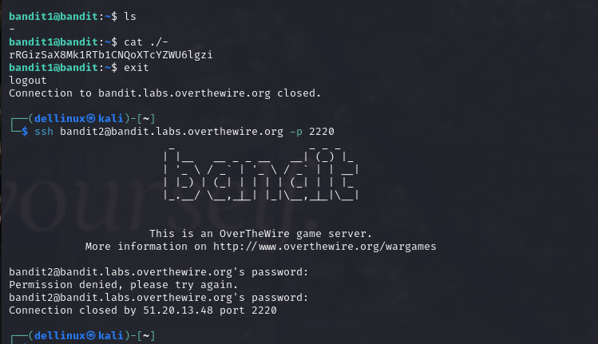
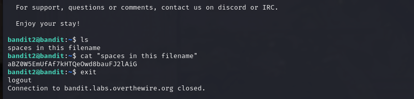
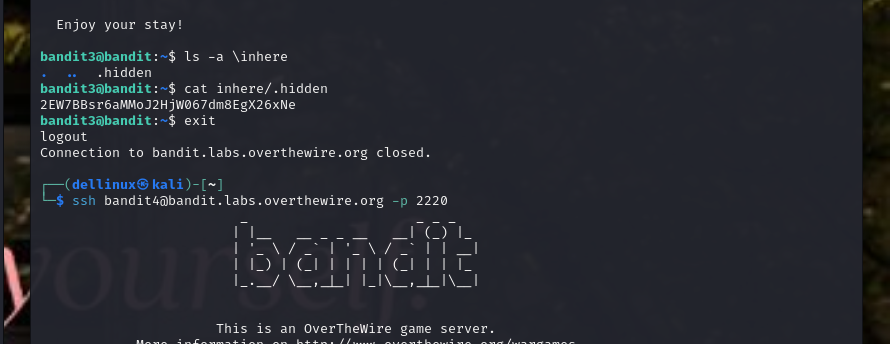
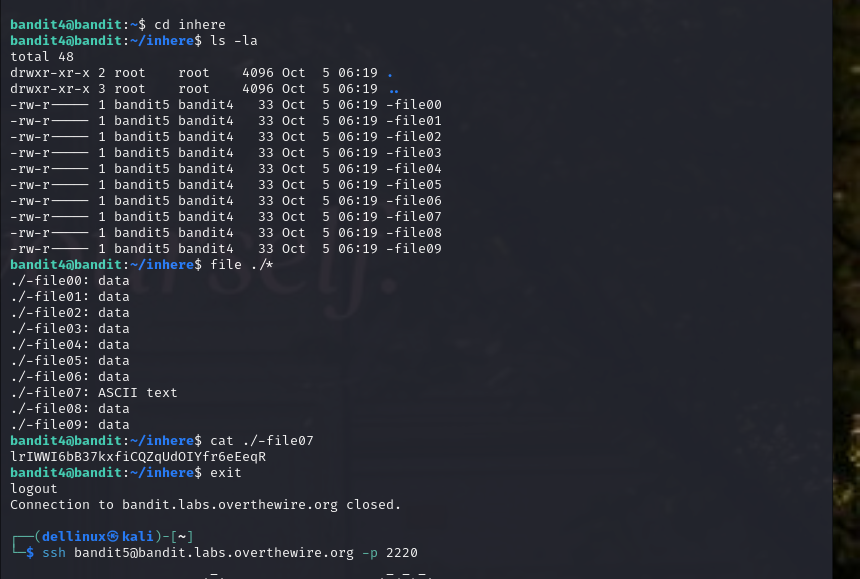
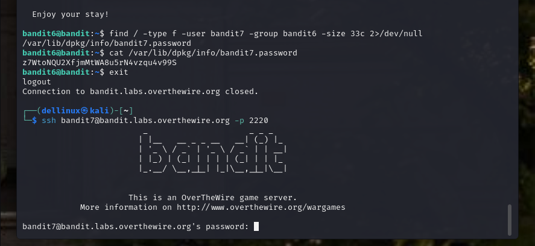
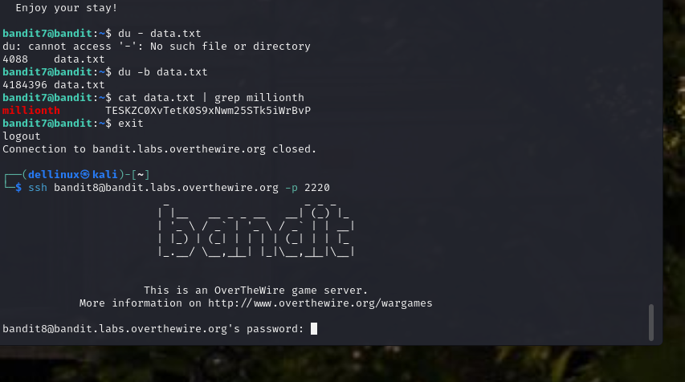
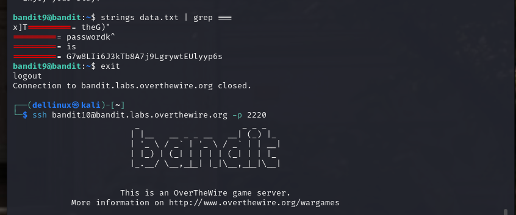

### Topic : BANDIT OVER THE WIRE

#### Level 0 - 5:

#### Challenge Overview:
- Started with Bandit OverTheWire's simple challenges which was to look for the password for next level.
- Level 0 was logging into the game using SSH.
- Level 1 was to get the password which was stored in a file called readme in the home directory.
- Level 2 was same like level 1 but this time the password was stored in a file name which had special character "-".
- Level 3 the password for the next level was stored in a file called spaces in this filename located in the home directory.
- Level 4 password was stored not in home directory as usaul but in inhere directory and was stored in a hidden file .
- Level 5 the password for next level was stored in the only human-readable file in the inhere directory.

#### Approach:
- Learned to use SSH and connected to the Bandit server.
- Used 'cd', 'ls', 'cat' commands to explore directories and read the content of files.
- Used basic shell commands to navigate through the filesystem.
- Added the path ./ when using cat command with special character filename instead of just cat <special_character_filename> because cat <special_character_filename> wouldnt return anything.

- Surrounded the filename with spaces with quotes to indicate that all of it belongs to the name for one file because without qoutes it assumes that  we looked for four files.

- Used ls -a to see all the files specifically hidden files.

- Instead of using the command file<filename>, used a wildcard to get the type for all the files.

#### Commands and Techniques used for level 0 - level 5:
- `ssh bandit0@bandit.labs.overthewire.org -p 2220`
- `ls`, `cat`, `cd`, `file`

#### Lessons Learned from the above five levels:
- It not not recommended to use special character as file name.
- It is unconventional and goes against best practice to include spaces in a filename.
- -a flag shows all files; both hidden and non-hidden files.
- Use a wildcard symbol(*) when dealing with multiple files in a directory.
- I have gained confidence in using SSH for secure connections and knowledge of basic Linux commands.

#### Level 6 - 10:

#### Challenge Overview:
- Challenges increased with more complex scenarios, involving filtering data and understanding permissions.
- Level 6 required searching for files based on specific criteria.
- Level 7 the password for the next level was stored in a file somewhere on the server.
- Level 8 introduced the concept of shell injection.
- Level 9 the password for the next level was stored in the file data.txt  and the line that occurs only once.
- Level 10 the password was stored in the file data.txt followed by several '='.

#### Approach:
- Utilized commands like 'find', 'grep', and 'sort' to filter and search for specific files.
- Used 'chmod' to permissions when necessary.
- Used find command with some other command to meet all the specified criteria.
- Used the pipe `|` to take the output of the first command as input into the second command.

- Appended 2>/dev/null which will hide all error messages for files that I do not have permission.
- Used grep to search lines that contain a specific pattern.
- To find the line that occurs only once in the file, we first sorted the lines and then filtered for the unique one.

- Used Strings command to extract human-readable strings from binary files.

#### Commands and Techniques:
- `find`,`du`, `grep`, `sort`, `chmod`, command substitution `$()`, `|`, `uniq`,`strings`

#### Lessons Learned:
- The potential dangers of unchecked user inputs in a shell environment.
- Improved problem-solving skills by analyzing challenges more thoroughly.
- Gained insights into file manipulation and security vulnerabilities.
- Recognizing encoded data and employing the appropriate decoding methods to retrieve meaningful information.
- Grep command is for searching patterns within files

### Level 11 - 15:

#### Challenge Overview:
- Challenges delved into cryptography, requiring decoding and encoding techniques.
- Level 11 involved reversing a ROT13 encoding, and Level 13 introduced the concept of using 'openssl' for encryption.

#### Approach:
- Researched ROT13 and implemented a custom script for decoding.
- Learned and applied various 'openssl' commands for encoding and decoding.
- Enhanced familiarity with file manipulation and data encryption.

#### Commands and Techniques:
- `tr`, `openssl`

#### Lessons Learned:
The challenges involved exploring the 'openssl' command, and improving file manipulation skills. These skills expanded the toolkit for cryptographic operations and improved the ability to navigate directories and extract data.

### Level 16 - 20:
//I couldnt proceed further

#### Personal Reflection:

---